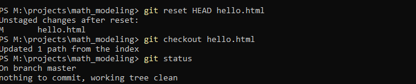
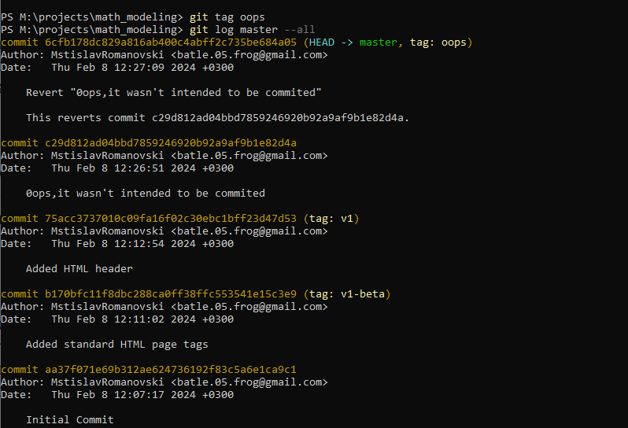
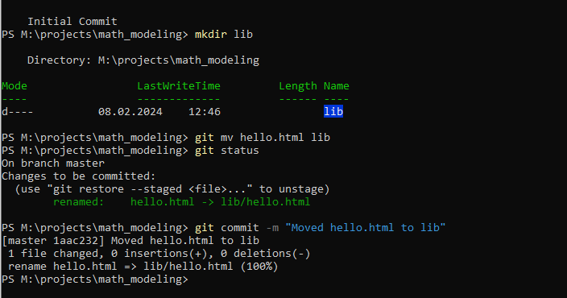
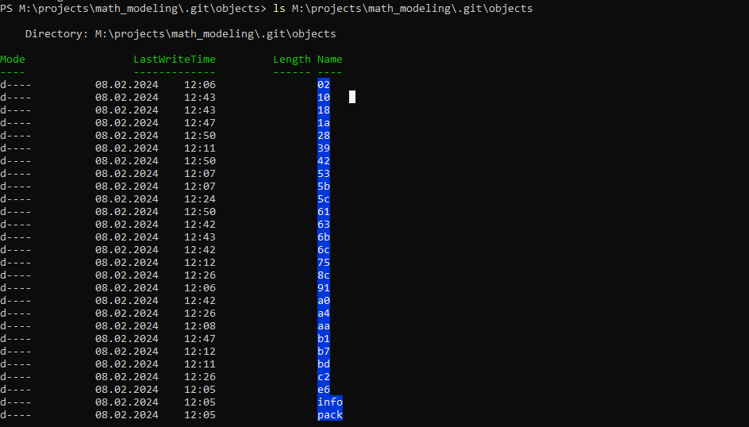
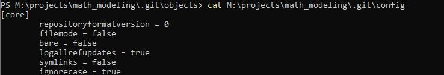
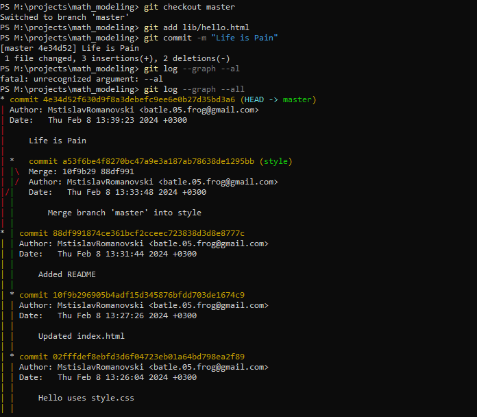
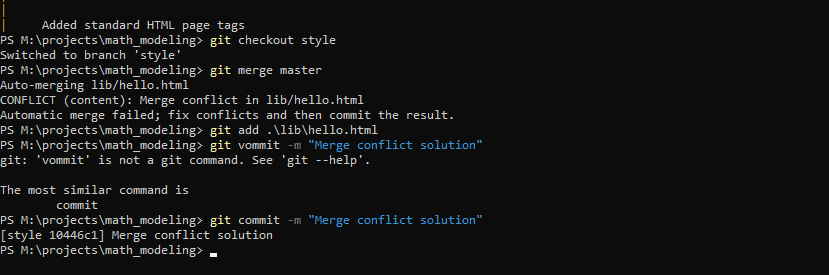
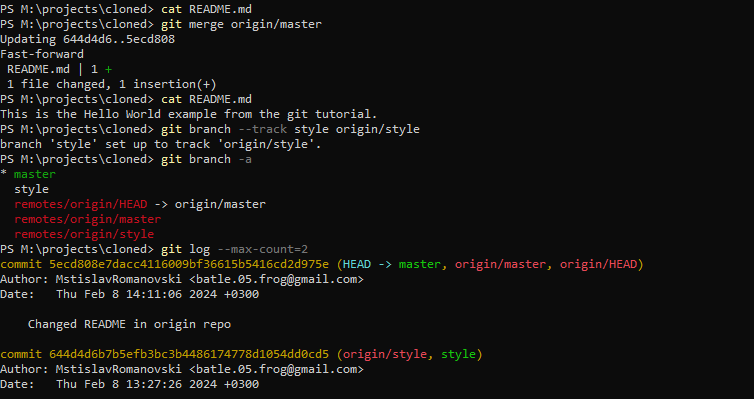
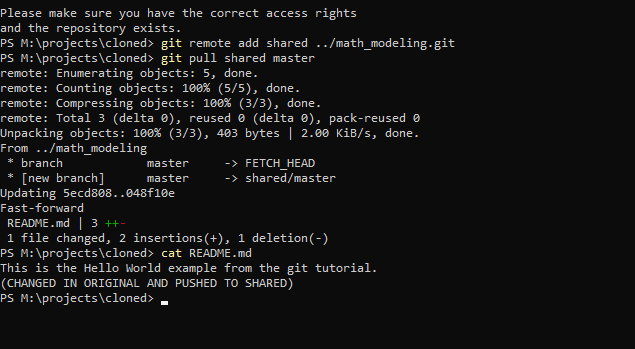

---
## Front matter
title: "Лабораторная работа 1"
subtitle: "Работа в GIT"
author: "Куденко Максим"
## Generic otions
lang: ru-RU
toc-title: "Содержание"

## Bibliography
bibliography: bib/cite.bib
csl: pandoc/csl/gost-r-7-0-5-2008-numeric.csl
## Pdf output format
toc: true # Table of contents
toc-depth: 2
fontsize: 12pt
linestretch: 1.5
papersize: a4
documentclass: scrreprt
## I18n polyglossia
polyglossia-lang:
  name: russian
  options:
	- spelling=modern
	- babelshorthands=true
polyglossia-otherlangs:
  name: english
## I18n babel
babel-lang: russian
babel-otherlangs: english
## Fonts
mainfont: Times New Roman
romanfont: Times New Roman
sansfont: Times New Roman
monofont: Times New Roman
mainfontoptions: Ligatures=TeX
romanfontoptions: Ligatures=TeX
sansfontoptions: Ligatures=TeX,Scale=MatchLowercase
monofontoptions: Scale=MatchLowercase,Scale=0.9
## Biblatex
biblatex: true
biblio-style: "gost-numeric"
biblatexoptions:
  - parentracker=true
  - backend=biber
  - hyperref=auto
  - language=auto
  - autolang=other*
  - citestyle=gost-numeric
## Pandoc-crossref LaTeX customization
figureTitle: "Рис."
tableTitle: "Таблица"
listingTitle: "Листинг"
lofTitle: "Список иллюстраций"
lotTitle: "Список таблиц"
lolTitle: "Листинги"
## Misc options
indent: true
header-includes:
  - \usepackage{indentfirst}
  - \usepackage{float} # keep figures where there are in the text
  - \floatplacement{figure}{H} # keep figures where there are in the text
---
# Цель работы

Вспомнить основы работы с системой контроля версий git.

# Задание:
Выполнение задания состоит из следующих этапов:

1.1 Подготовка

- 1.1.1 Установка имени и электронной почты

- 1.1.2 Параметры установки окончаний строк

- 1.1.3 Установка отображения unicode

1.2 Создание проекта

- 1.2.1 Создайте страницу «Hello, World»

- 1.2.2 Создание репозитория

- 1.2.3 Добавление файла в репозиторий

- 1.2.4 Проверка состояние репозитория

1.3 Внесение изменений

- 1.3.1 Измените страницу «Hello, World»

1.4 Индексация изменений

- 1.4.1 Коммит изменений

- 1.4.2 Добавьте стандартные теги страницы

- 1.4.3 История

- 1.4.4 Получение старых версий

- 1.4.5 Создание тегов версий

- 1.4.6 Переключение по имени тега

- 1.4.7 Просмотр тегов с помощью команды tag

1.5 Отмена локальных изменений (до индексации)

- 1.5.1 Переключитесь на ветку master

- 1.5.2 Измените hello.html

- 1.5.3 Проверьте состояние

- 1.5.4 Отмена изменений в рабочем каталоге

1.6 Отмена проиндексированных изменений (перед коммитом)

- 1.6.1 Измените файл и проиндексируйте изменения

- 1.6.2 Проверьте состояние

- 1.6.3 Выполните сброс буферной зоны

- 1.6.4 Переключитесь на версию коммита

1.7 Отмена коммитов

- 1.7.2 Измените файл и сделайте коммит

- 1.7.3 Сделайте коммит с новыми изменениями, отменяющими предыдущие

- 1.7.4 Проверьте лог

1.8 Удаление коммиттов из ветки

- 1.8.1 Команда git reset

- 1.8.2 Проверьте нашу историю

- 1.8.3 Для начала отметьте эту ветку

- 1.8.4 Сброс коммитов к предшествующим коммиту Oops

1.9 Удаление тега oops

- 1.9.1 Удаление тега oops

1.10 Внесение изменений в коммиты

- 1.10.1 Измените страницу, а затем сделайте коммит

- 1.10.2 Необходим email

- 1.10.3 Измените предыдущий коммит

- 1.10.4 Просмотр истории

1.11 Перемещение файлов

- 1.11.1 Переместите файл hello.html в каталог lib

1.12 Подробнее о структуре

- 1.12.1 Добавление index.html

1.13  Git внутри: Каталог .git

- 1.13.1 Каталог .git

- 1.13.2 База данных объектов

- 1.13.3 Углубляемся в базу данных объектов

- 1.13.4 Config File

- 1.13.5 Ветки и теги

- 1.13.6 Файл HEAD

1.14  Работа непосредственно с объектами git

- 1.15.1 Поиск последнего коммита

- 1.15.2 Вывод последнего коммита с помощью SHA1 хэша

- 1.15.3 Поиск дерева

- 1.15.4 Вывод каталога lib

- 1.15.5 Вывод файла hello.html

- 1.15.6 Дальнейшее исследование

1.15 Создание ветки

- 1.15.1 Создание ветки

- 1.15.2 Добавление файла стилей style.css

- 1.15.3 измненение основной страницы

- 1.15.4 Изменение index.html

1.16 Навигация по веткам

-1.16.1 Переключение на ветку master

-1.16.2 возврат к ветке style

1.17 Изменения в ветке master

- 1.17.1 Создание файла README в ветке master

1.18 Сделайте коммит изменений README.md в ветку master.

- 1.18.2 Просмотр текущих веток

1.19 Слияние

- 1.19.1 Слияние веток

1.20 Создание конфликта

- 1.20.1 Возврат в master и создание конфликта

- 1.20.2 Просмотр веток

1.21 Разрешение конфликтов

- 1.21.1 Слияние master с веткой style

- 1.21.2 Решение конфликта

- 1.21.3 коммит решения конфликта

1.22 Сброс ветки style

- 1.22.1  Сброс ветки style

- 1.22.2 Проверка ветки

1.23 Сброс ветки master 

-1.23.1 Сброс ветки master

1.24 Перебазирование

1.25 Слияние в ветку master 

- 1.25.1 Слияние style в master 

- 1.25.2 Просмотр логов

1.26  Клонирование репозиториев

-1.26.1 Переход в рабочий каталог 

-1.26.2 Создание клона репозетория hello

1.27 Просмотр клонированного репозитория 

- 1.27.1 Просмотр клонированного репозитория

- 1.27.2 Просмотр истории репозитория

1.28 origin

1.29 Удаленные ветки

- 1.29.1 Список удаленных веток

1.30 Изменение оригинального репозитория

- 1.30.1 Внесение в оригинальный репозиторий hello

- 1.30.2 Извлечение изменений

- 1.30.3 Проверка README.md

1.31 Слияние извлеченных изменнений

- 1.31.1 Слив изменений в master

- 1.31.2 Проверка README.md

1.32 Добавление ветки наблюдения

- 1.32 добавление локальной ветки с отслеживанием удаленной ветки

1.33 Чистый репозиторий

1.34 Добавление удаленного репозитория

1.37 Отправка изменений

1.38 Извлечение общих изменений

# Ход работы
1.1 Подготовка
- 1.1.1 Установка имени и электронной почты(Скриншот 1, 1я и 2я строка)

- 1.1.2 Применение параметров установки окончаний строк(Скриншот 1 3я и 4я строка)

- 1.1.3 Установка отображения unicode(Скриншот 1 5я строка)

( Скриншот 1 )
	
1.2 Создание проекта

- 1.2.1 Создание страницы «Hello, World» (Скриншот 2)

- 1.2.2 Создание репозитория (Скриншот 2)

- 1.2.3 Добавление файла в репозиторий (Скриншот 2)

- 1.2.4 Проверка состояние репозитория (Скриншот 2)

( Скриншот 2 )
	
1.3 Внесение изменений

- 1.3.1 Изменение страницы «Hello, World»
		Добавим кое-какие HTML-теги к нашему приветствию. Измените содержимое файла hello.html на:
		'''
		<h1>Hello, World!</h1>
		'''
1.4 Индексация изменений

( Скриншот 3 )
	
- 1.4.1 Коммит изменений
		Делаем коммит, должен открыться редактор
		'''
		get commit
		'''
		проверяем статус
		'''
		get status
		'''
- 1.4.2 Добавьте стандартные теги страницы
		Добавим теги 
		'''
		<html>
			<body>
				<h1>Hello, World!</h1>
			</body>
		</html>
		'''
		Добавим изменение в индекс а затем изменим файл следующим образом:
		
		'''
		git add hello.html
		'''
		
		'''
		<html>
			<head>
			<head>
			<body>
				<h1>Hello, World!</h1>
			</body>
		</html>
		'''
		И проверим статус
		
		'''
		git status
		'''
		
	
	( Скриншот 4 )
		
		Далее проводим коммит, проверяем состояние, вводим изменение в индекс, проверяем состояние и коммитим:
		'''
		git commit -m "Added standard HTML page tags"
		git status
		git add .
		git status
		git commit -m "Added HTML header"
		'''
		

( Скриншот 4 )
		
		
- 1.4.3 История
		Вводим ''' git log ''' в консоль (Скриншот 5)
		

( Скриншот 5 )
	- 1.4.4 Получение старых версий
	

( Скриншот 6 )
	- 1.4.5 Создание тегов версий
	

( Скриншот 7 )

- 1.4.6 Переключение по имени тега
		'''
		git checkout v1
		git checkout v1-beta
		'''
- 1.4.7 Просмотр тегов с помощью команды tag

( Скриншот 8 )
	
1.5 Отмена локальных изменений (до индексации)
- 1.5.1 Переключитесь на ветку master
- 1.5.2 Измените hello.html
		'''
			<html>
				<head>
				</head>
				<body>
					<h1>Hello, World!</h1>
					<!-- This is a bad comment. We want to revert it. -->
				</body>
			</html>
		'''
- 1.5.3 Проверьте состояние
		'''
		git status
		'''
- 1.5.4 Отмена изменений в рабочем каталоге
		'''
		git checkout hello.html
		git status
		cat hello.html
		'''
	
	( Скриншот 9 )
	
1.6 Отмена проиндексированных изменений (перед коммитом)
- 1.6.1 Измените файл и проиндексируйте изменения
		'''
		<html>
			<head>
				<!-- This is an unwanted but staged comment -->
			</head>
			<body>
				<h1>Hello, World!</h1>
			</body>
		</html>
		'''
- 1.6.2 Проверьте состояние
		'''
		git status
		'''
- 1.6.3 Выполните сброс буферной зоны
		'''
		git reset HEAD hello.html
		'''
- 1.6.4 Переключитесь на версию коммита
		'''
		git checkout hello.html
		git status
		'''
	
	( Скриншот 10 )
	
1.7 Отмена коммитов
- 1.7.1 Измените файл и сделайте коммит
	'''
		<html>
			<head>
			</head>
			<body>
				<h1>Hello, World!</h1>
				<!-- This is an unwanted but committed change -->
			</body>
		</html>
	'''
	'''
	git add hello.html
	git commit -m "Oops, we didn't want this commit"
	'''
- 1.7.2 Сделайте коммит с новыми изменениями, отменяющими предыдущие
		'''
		git revert HEAD
		'''
- 1.7.3 Проверьте лог
		'''
		git log
		'''

( Скриншот 11 )
	
1.8 Удаление коммиттов из ветки
- 1.8.1 Проверка истории
		'''
		git log
		'''
- 1.8.2 Присвоим метку ветке
		'''
		git tag oops
		'''
- 1.8.3 Сброс коммитов к предшествующим коммиту Oops
		'''
		git reset --hard v1
		git log
		'''

( Скриншот 12 )	
.png)
( Скриншот 13 )
	
1.9 Удаление тега oops
	- 1.9.1 Удаление тега oops
	

( Скриншот 14 )
	
1.10 Внесение изменений в коммиты
- 1.10.1 Измените страницу, а затем сделайте коммит
		'''
		<!-- Author: Dmitry S. Kulyabov -->
			<html>
				<head>
				</head>
				<body>
					<h1>Hello, World!</h1>
				</body>
			</html>
		'''
		'''
		git add hello.html
		git commit -m "Add an author comment"
		'''
- 1.10.2 Необходим email
		'''
		<!-- Author: Dmitry S. Kulyabov (kulyabov-ds@rudn.ru) -->
		<html>
			<head>
			</head>
			<body>
				<h1>Hello, World!</h1>
			</body>
		</html>

		'''
- 1.10.3 Измените предыдущий коммит
		'''
		git add hello.html
		git commit --amend -m "Add an author/email comment"
		'''
- 1.10.4 Просмотр истории
		'''
		git log
		'''

( Скриншот 15 )

1.11 Перемещение файлов
- 1.11.1 Переместите файл hello.html в каталог lib

( Скриншот 16 )
	
1.12 Подробнее о структуре
- 1.12.1 Добавление index.html
	

( Скриншот 17 )

1.13  Git внутри: Каталог .git
- 1.13.1 Каталог .git
		'''
		cd ../.git
		'''
- 1.13.2 База данных объектов
		
		( Скриншот 18 )
- 1.13.3 Config File
		
		( Скриншот 19 )
- 1.13.4 Ветки и теги
		
		( Скриншот 20 )
- 1.13.5 Файл HEAD
		
		( Скриншот 21 )

1.14  Работа непосредственно с объектами git
- 1.14.1 Поиск последнего коммита
		'''
		git log --max-count=1
		'''
- 1.14.2 Вывод последнего коммита с помощью SHA1 хэша
		'''
		git cat-file -t <hash>
		git cat-file -p <hash>
		'''
- 1.14.3 Поиск дерева
		'''
		git cat-file -p <treehash>
		'''
- 1.14.4 Вывод каталога lib
		'''
		git cat-file -p <libhash>
		'''
- 1.14.5 Вывод файла hello.html
		'''
		git cat-file -p <hellohash>
		'''
- 1.14.6 Дальнейшее исследование
		Просто берем хэш у parent и ищем предыдущие коммиты
	
	( Скриншот 22 )
	.png)
	( Скриншот 22 )
1.15 Создание ветки
- 1.15.1 Создание ветки
		'''
		git checkout -b style
		git status
		'''
- 1.15.2 Добавление файла стилей style.css
		'''
		New-Item lib/style.css
		'''
		Содержиоме style.css
		'''
		h1 {
			color: red;
		}
		'''
		'''
		git add lib/style.css
		git commit -m "Added css stylesheet"
		'''
- 1.15.3 измненение основной страницы
		'''
		<!-- Author: Dmitry S. Kulyabov (kulyabov-ds@rudn.ru) -->
			<html>
				<head>
					<link type="text/css" rel="stylesheet"
						media="all" href="style.css" />
				</head>
				<body>
					<h1>Hello, World!</h1>
				</body>
			</html>

		'''
		'''
		git add lib/hello.html
		git commit -m "Hello uses style.css"

		'''
- 1.15.4 Изменение index.html
		'''
		<html>
			<head>
				<link type="text/css" rel="stylesheet"
					media="all" href="lib/style.css" />
			</head>
			<body>
				<iframe src="lib/hello.html" width="200" height="200" />
			</body>
		</html>
		'''
		'''
		git add index.html
		git commit -m "Updated index.html"

		'''
	
	( Скриншот 23 )
		
1.16 Навигация по веткам
-1.16.1 Переключение на ветку master
		'''
		git checkout master
		cat lib/hello.html
		'''
- 1.16.2 возврат к ветке style
		'''
		git checkout style
		cat lib/hello.html
		'''
		

( Скриншот 24 )

1.17 Изменения в ветке master
- 1.17.1 Создание файла README в ветке master
		'''
		New-Item README.md
		'''
1.18 Сделайте коммит изменений README.md в ветку master.
	'''
	git add README.md
	git commit -m "Added README"
	'''
- 1.18.2 Просмотр текущих веток
		'''
		git log --graph --all
		'''

( Скриншот 25 )
1.19 Слияние
- 1.19.1 Слияние веток
		'''
		git checkout style
		git merge master
		git log --graph --all
		'''
		

( Скриншот 26 )

1.20 Создание конфликта
- 1.20.1 Возврат в master и создание конфликта
		'''
		git checkout master
		'''
		'''
		<!-- Author: Dmitry S. Kulyabov (dskulyabov@rudn.ru) -->
		<html>
			<head>
				<!-- no style -->
			</head>
			<body>
				<h1>Hello, World! Life is great!</h1>
			</body>
		</html>
		'''
		'''
		git add lib/hello.html
		git commit -m 'Life is great'
		'''
- 1.20.2 Просмотр веток
		'''
		git log --graph --all
		'''
	
	

( Скриншот 27 )
	
1.21 Разрешение конфликтов
- 1.21.1 Слияние master с веткой style
- 1.21.2 Решение конфликта
- 1.21.3 коммит решения конфликта

( Скриншот 28 )
	
1.22 Сброс ветки style
- 1.22.1  Сброс ветки style
- 1.22.2 Проверка ветки

( Скриншот 29 )	

1.23 Сброс ветки master 
	
-1.23.1 Сброс ветки master

( Скриншот 29 )
	
1.24 Перебазирование

-1.23.1 Сброс ветки master

	
1.25 Слияние в ветку master 

- 1.25.1 Слияние style в master 
- 1.25.2 Просмотр логов

( Скриншот 30 )
	
1.26  Клонирование репозиториев
- 1.26.1 Переход в рабочий каталог 
- 1.26.2 Создание клона репозетория hello

( Скриншот 31 )
	
1.27 Просмотр клонированного репозитория 
- 1.27.1 Просмотр клонированного репозитория
- 1.27.2 Просмотр истории репозитория
	

( Скриншот 32 )
	
1.28 origin

( Скриншот 33 )

1.29 Удаленные ветки
- 1.29.1 Список удаленных веток

( Скриншот 34 )
	
1.30 Изменение оригинального репозитория
- 1.30.1 Внесение в оригинальный репозиторий hello
- 1.30.2 Извлечение изменений
- 1.30.3 Проверка README.md
	

( Скриншот 35 )

1.31 Слияние извлеченных изменнений
- 1.31.1 Слив изменений в master
- 1.31.1 Проверка README.md

( Скриншот 36 )

1.32 Добавление ветки наблюдения
- 1.32 добавление локальной ветки с отслеживанием удаленной ветки

( Скриншот 37 )

1.33 Чистый репозиторий

( Скриншот 38 )

1.34 Добавление удаленного репозитория

( Скриншот 39 )

1.37 Отправка изменений

( Скриншот 40 )

1.38 Извлечение общих изменений

( Скриншот 41 )
