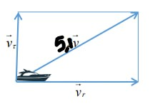

---
## Front matter
title: "Лабораторная работа 2"
subtitle: "Работа в GIT"
author: "Куденко Максим"
## Generic otions
lang: ru-RU
toc-title: "Содержание"

## Bibliography
bibliography: bib/cite.bib
csl: pandoc/csl/gost-r-7-0-5-2008-numeric.csl
## Pdf output format
toc: true # Table of contents
toc-depth: 2
fontsize: 12pt
linestretch: 1.5
papersize: a4
documentclass: scrreprt
## I18n polyglossia
polyglossia-lang:
  name: russian
  options:
	- spelling=modern
	- babelshorthands=true
polyglossia-otherlangs:
  name: english
## I18n babel
babel-lang: russian
babel-otherlangs: english
## Fonts
mainfont: Times New Roman
romanfont: Times New Roman
sansfont: Times New Roman
monofont: Times New Roman
mainfontoptions: Ligatures=TeX
romanfontoptions: Ligatures=TeX
sansfontoptions: Ligatures=TeX,Scale=MatchLowercase
monofontoptions: Scale=MatchLowercase,Scale=0.9
## Biblatex
biblatex: true
biblio-style: "gost-numeric"
biblatexoptions:
  - parentracker=true
  - backend=biber
  - hyperref=auto
  - language=auto
  - autolang=other*
  - citestyle=gost-numeric
## Pandoc-crossref LaTeX customization
figureTitle: "Рис."
tableTitle: "Таблица"
listingTitle: "Листинг"
lofTitle: "Список иллюстраций"
lotTitle: "Список таблиц"
lolTitle: "Листинги"
## Misc options
indent: true
header-includes:
  - \usepackage{indentfirst}
  - \usepackage{float} # keep figures where there are in the text
  - \floatplacement{figure}{H} # keep figures where there are in the text
---
# Цель работы

Рассмотреть пример построения математической модели для выбора правильной стратегии при решении задач поиска.
Рассмотреть задачу преследования браконьеров береговой охраной. На море в тумане катер береговой охраны преследует лодку браконьеров.
Через определенный промежуток времени туман рассеивается, и лодка обнаруживается на расстоянии k км от катера. 
Затем лодка снова скрывается в тумане и уходит прямолинейно в неизвестном направлении. Известно, что скорость катера в 2 раза больше скорости браконьерской лодки.
Необходимо определить по какой траектории необходимо двигаться катеру,чтобы догнать лодку

# Задание:

1. Провести рассуждения и вывод дифференциальных уравнений,
если скорость катера больше скорости лодки в n раз (значение n задайте
самостоятельно)
2. Построить траекторию движения катера и лодки для двух случаев. (Задайте
самостоятельно начальные значения)
Определить по графику точку пересечения катера и лодки

# Ход выполнения работы

1. Принимаем $t_0=0$, $x_0=0$ - место нахождения  лодки браконьеров в момент обнаружения, $x_{k0}=k$ - место о нахождения катера береговой охраны
относительно лодки браконьеров в момент обнаружения лодки.
2. Введем полярные координаты. Считаем, что полюс - это точка обнаружения лодки браконьеров $x_{л0} (\theta=x_{л0}=0)$, а полярная ось r проходит через точку нахождения катера береговой охраны.
3. Траектория катера должна быть такой, чтобы и катер, и лодка все время были на одном расстоянии от полюса $\theta$, только в этом случае траектория
катера пересечется с траекторией лодки. 
4. Чтобы найти расстояние x (расстояние после которого катер начнет двигаться вокруг полюса), необходимо составить простое уравнение. Пусть
через время t катер и лодка окажутся на одном расстоянии x от полюса. За это время лодка пройдет $x$, а катер $k-x$ (или $k+x$ в зависимости от
начального положения катера относительно полюса). Время, за которое они пройдут это расстояние, вычисляется как $\frac{x}{v}$ или как $\frac{k-x}{nv}$ ($\frac{k+x}{nv}$ для второго случая).
Так как время одно и то же, то эти величины одинаковы.
Тогда неизвестное расстояние x можно найти из следующего уравнения:
$\frac{x}{v}=\frac{k-x}{nv}$ в первом случае или
$\frac{x}{v}=\frac{k+x}{nv}$ во втором.

Отсюда проучим два занчения $x_1=\frac{k}{n+1}$ и $x_1=\frac{k}{n-1}$.

5. После того, как катер береговой охраны окажется на одном расстоянии от полюса, что и лодка, он должен сменить прямолинейную траекторию и
начать двигаться вокруг полюса удаляясь от него со скоростью лодки v.
Для этого скорость катера раскладываем на две составляющие: $v_r$ - радиальная скорость и $v_{\tau}$ - тангенциальная скорость.
Радиальная скорость - это скорость, с которой  катер удаляется от полюса, $v_r=\frac{dr}{dt}$. Нам нужно, чтобы эта скорость была равна скорости лодки, 
поэтому полагаем $\frac{dr}{dt}=v$.
Тангенциальная скорость – это линейная скорость вращения катера относительно полюса. 
Она равна произведению угловой скорости $\frac{d\theta}{dt}$ на радиус r , $v_r=r\frac{d\theta}{dt}$

(Screen 1)
Из рисунка видно: $v_{\tau}=\sqrt[2]{4v^2-v^{2}}=\sqrt[2]{4.2}v$.
Тогда получаем $r\frac{d\theta}{dt}=\sqrt[2]{4.2}v$.

6. Решение исходной задачи сводится к решению системы из двух дифференциальных уравнений 
\begin{equation*}
 \begin{cases}
   \frac{dr}{dt} =  v\\
   \frac{d\theta}{dt} =  \sqrt[2]{4.2}v
 \end{cases}
\end{equation*}

с начальными условиями
\begin{equation*}
 \begin{cases}
   \theta_0 =  0\\
   r_0 = x_1
 \end{cases}
\end{equation*}

или 
\begin{equation*}
 \begin{cases}
   \theta_0 =  -\pi \\
   r_0 = x_2
 \end{cases}
\end{equation*}

Исключая из полученной системы производную по t, можно перейти к следующему уравнению:
$\frac{dr}{d\theta}=\theta{r}{\sqrt[2]{4.2}}$

Для решения задачи напишем такой код 

'''
//# загружаем библиотеки
using Plots
using DifferentialEquations

# distance between coastguard boat and smuggler's boat
const s = 17.3
const n = 5.1

#distance from the spiral beginning
const r01 = s/(n+1)
const r02 = s/(n-1)

const I1 = (-1, 3*pi)
const I2 = (-pi, pi)

function F(u,p,t)
	return u / sqrt(n*n -1)
end

#diff equation and it's solution
problem = ODEProblem(F,r01,I1)

res = solve(problem, abstol=1e-8,reltol=1e-8)
@show res.u
@show res.t

dxR = rand(1:size(res.t)[1])
rAng = [res.t[dxR] for i in 1:size(res.t)[1]]

#canvas1
plt = plot(proj=:polar, aspect_ratio =:equal, dpi = 1000, legend=true,bg=:white)
plot!(plt,xlabel="theta",ylabel="r(t)",title="Chase task - case 1", legend=:outerbottom)
plot!(plt,[rAng[1],rAng[2]], [0.0,res.u[size(res.u)[1]]],label="smuggler's boat trajectory", color=:blue,lw = 1)
scatter!(plt,rAng,res.u,label = "",mc=:blue,ms=0.0005)
plot!(plt,res.t,res.u,xlabel = "theta", ylabel = "r(t)", label = "coastguard boat trajectory", colot=:green, lw = 1 )
scatter!(plt,res.t,res.u,label="",mc=:green, ms=0.0005)

savefig(plt, "lab02_01.png")

problem = ODEProblem(F,r02,I2)
res = solve(problem, abstol=1e-8,reltol=1e-8)
dxR = rand(1:size(res.t)[1])
rAng = [res.t[dxR] for i in 1:size(res.t)[1]]

#canvas2
plt2 = plot(proj=:polar, aspect_ratio =:equal, dpi = 1000, legend=true,bg=:white)
plot!(plt2,xlabel="theta",ylabel="r(t)",title="Chase task - case 1", legend=:outerbottom)
plot!(plt2,[rAng[1],rAng[2]], [0.0,res.u[size(res.u)[1]]],label="smuggler's boat trajectory", color=:blue,lw = 1)
scatter!(plt2,rAng,res.u,label = "",mc=:blue,ms=0.0005)
plot!(plt2,res.t,res.u,xlabel = "theta", ylabel = "r(t)", label = "coastguard boat trajectory", colot=:green, lw = 1 )
scatter!(plt2,res.t,res.u,label="",mc=:green, ms=0.0005)

savefig(plt2, "lab02_02.png")
'''

Резульатат:

(Screen 2)

(Screen 3)

(Screen 4)

Координаты встречи 1: 300,-8
Координаты встречи 2: 180,0

# Заключение
Цели выполнены, задачи достигнуты. Был рассмотрен пример математической модели погони а также были построены графики к этой модели.