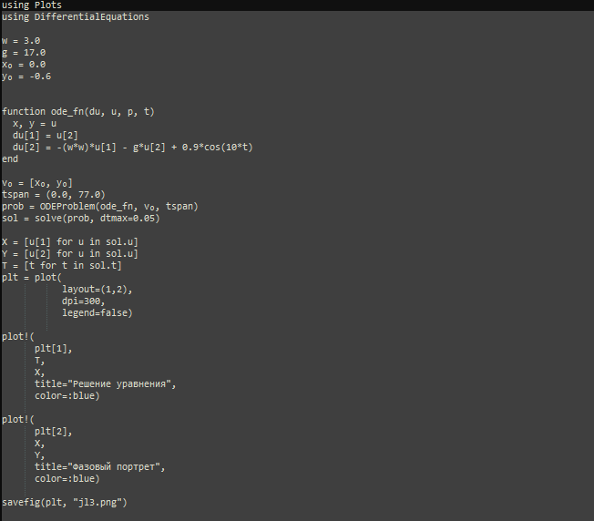
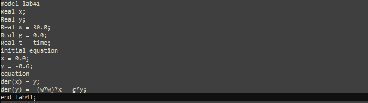
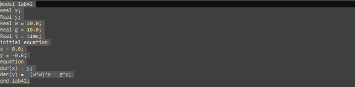
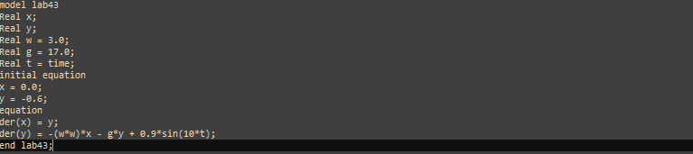

---
## Front matter
lang: ru-RU
title: Лабораторная работа номер 4
author: Malkov Roman Sergeevich
date: 01.03.2024

## Formatting
toc: false
slide_level: 2
theme: metropolis
header-includes: 
 - \metroset{progressbar=frametitle,sectionpage=progressbar,numbering=fraction}
 - '\makeatletter'
 - '\beamer@ignorenonframefalse'
 - '\makeatother'
aspectratio: 43
section-titles: true
---

# Цель работы

Изучить понятие гармонического осциллятора, построить фазовый портрет и найти решение уравнения гармонического осциллятора.

# Теоретическое введение

- Гармонический осциллятор [1] — система, которая при смещении из положения равновесия испытывает действие возвращающей силы F, пропорциональной смещению x.

- Гармоническое колебание [2] - колебание, в процессе которого величины, характеризующие движение (смещение, скорость, ускорение и др.), изменяются по закону синуса или косинуса (гармоническому закону).

# Теоретическое введение

Уравнение свободных колебаний гармонического осциллятора имеет следующий вид:
$$\ddot{x}+2\gamma\dot{x}+\omega_0^2=0$$

где $x$ - переменная, описывающая состояние системы (смещение грузика, заряд конденсатора и т.д.), $\gamma$ - параметр, характеризующий потери энергии (трение в механической системе, сопротивление в контуре), $\omega_0$ - собственная частота колебаний.
Это уравнение есть линейное однородное дифференциальное  уравнение второго порядка и оно является примером линейной динамической системы.

# Теоретическое введение

При отсутствии потерь в системе ( $\gamma=0$ ) получаем уравнение консервативного осциллятора энергия колебания которого сохраняется во времени.
$$\ddot{x}+\omega_0^2x=0$$

# Теоретическое введение

Для однозначной разрешимости уравнения второго порядка необходимо задать два начальных условия вида
 
$$
 \begin{cases}
	x(t_0)=x_0
	\\   
	\dot{x(t_0)}=y_0
 \end{cases}
$$

# Теоретическое введение

Уравнение второго порядка можно представить в виде системы двух уравнений первого порядка:
$$
 \begin{cases}
	x=y
	\\   
	y=-\omega_0^2x
 \end{cases}
$$

# Теоретическое введение

Начальные условия для системы примут вид:
$$
 \begin{cases}
	x(t_0)=x_0
	\\   
	y(t_0)=y_0
 \end{cases}
$$

Независимые	переменные	$x, y$	определяют	пространство,	в	котором «движется» решение. Это фазовое пространство системы, поскольку оно двумерно будем называть его фазовой плоскостью.

Значение фазовых координат $x, y$ в любой момент времени полностью определяет состояние системы. Решению уравнения движения как функции времени отвечает гладкая кривая в фазовой плоскости. Она называется фазовой траекторией. Если множество различных решений (соответствующих различным 
начальным условиям) изобразить на одной фазовой плоскости, возникает общая картина поведения системы. Такую картину, образованную набором фазовых траекторий, называют фазовым портретом.

# Задачи

1. Разобраться в понятии гармонического осциллятора

2. Ознакомиться с уравнением свободных колебаний гармонического осциллятора

3. Построить фазовый портрет гармонического осциллятора и решение уравнения на языках Julia и Open Modelica гармонического осциллятора для следующих случаев:
- Колебания гармонического осциллятора без затуханий и без действий внешней силы	
- Колебания гармонического осциллятора c затуханием и без действий внешней силы 	
- Колебания гармонического осциллятора c затуханием и под действием внешней силы	

# Задание

Вариант 59:

Постройте фазовый портрет гармонического осциллятора и решение уравнения гармонического осциллятора для следующих случаев:

1. Колебания гармонического осциллятора без затуханий и без действий внешней силы $\ddot{x}+30x=0$;
2. Колебания гармонического осциллятора c затуханием и без действий внешней силы $\ddot{x}+10\dot{x}+20x=0$
3. Колебания гармонического осциллятора c затуханием и под действием внешней силы $\ddot{x}+17\dot{x}+3x=0.9cos(10t)$	

На интервале $t\in [0;77]$ (шаг $0.05$) с начальными условиями $x_0=0.0, y_0=-0.6$.

# Выполнение лабораторной работы

Код программы для первого случая:

{#fig:001}

# Выполнение лабораторной работы

Код программы для второго случая:

{#fig:002}

# Выполнение лабораторной работы

Код программы для третьего случая:

{#fig:003}

# Выполнение лабораторной работы

Первый случай: 

{#fig:004}

# Выполнение лабораторной работы

Второй случай:

{#fig:005}

# Выполнение лабораторной работы

Третий случай:

{#fig:006}

# Выполнение лабораторной работы

Код программы для первого случая:

{#fig:007}

# Выполнение лабораторной работы

Код программы для второго случая:

{#fig:008}

# Выполнение лабораторной работы

Код программы для третьего случая:

{#fig:009}

# Выполнение лабораторной работы

Первый случай: 

Колебания гармонического осциллятора без затуханий и без действий внешней силы

{#fig:010}

# Выполнение лабораторной работы

Второй случай:

Колебания гармонического осциллятора c затуханием и без действий внешней силы

{#fig:011}

# Выполнение лабораторной работы

Третий случай:

Колебания гармонического осциллятора c затуханием и под действием внешней силы

{#fig:012}

# Анализ полученных результатов. Сравнение языков.

В итоге проделанной работы мы построили три графика для вышеуказанных моделей на языках Julia и OpenModelica. Построение моделей колебания на языке OpenModelica занимает меньше строк, чем аналогичное построение на Julia.

# Вывод

В ходе выполнения лабораторной работы были построены решения уравнения гармонического осциллятора и фазовые портреты гармонических колебаний без затухания, с затуханием и при действии внешней силы на языках Julia и Open Modelica.