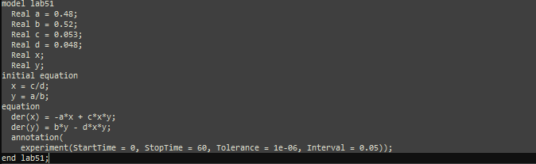
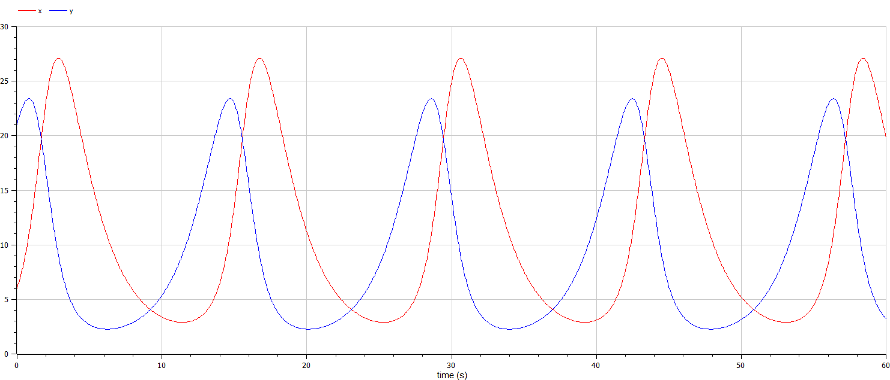
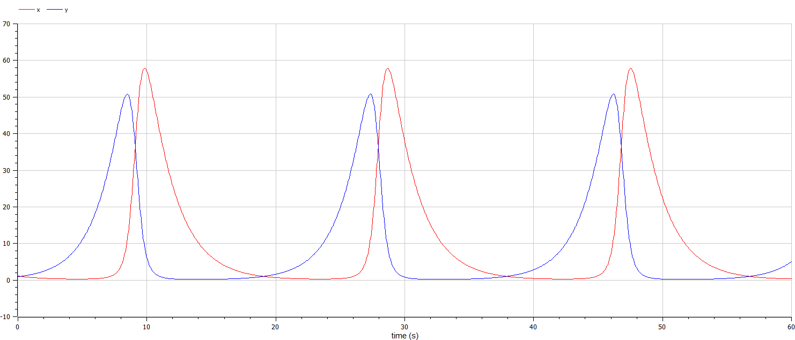

---
## Front matter
lang: ru-RU
title: Лабораторная работа номер 5
author: Malkov Roman Sergeevich
date: 01.03.2024

## Formatting
toc: false
slide_level: 2
theme: metropolis
header-includes: 
 - \metroset{progressbar=frametitle,sectionpage=progressbar,numbering=fraction}
 - '\makeatletter'
 - '\beamer@ignorenonframefalse'
 - '\makeatother'
aspectratio: 43
section-titles: true
---

# Цель работы

Изучить жесткую модель хищник-жертва и построить эту модель.

# Теоретическое введение

- Модель Лотки—Вольтерры — модель взаимодействия двух видов типа «хищник — жертва», названная в честь её авторов, которые предложили модельные уравнения независимо друг от друга. Такие уравнения можно использовать для моделирования систем «хищник — жертва», «паразит — хозяин», конкуренции и других видов взаимодействия между двумя видами. [4]

Данная двувидовая модель основывается на
следующих предположениях:

1. Численность популяции жертв x и хищников y зависят только от времени (модель не учитывает пространственное распределение популяции на занимаемой территории)	
2. В отсутствии взаимодействия численность видов изменяется по модели Мальтуса, при этом число жертв увеличивается, а число хищников падает	
3. Естественная смертность жертвы и естественная рождаемость хищника считаются несущественными	
4. Эффект насыщения численности обеих популяций не учитывается	
5. Скорость роста численности жертв уменьшается пропорционально численности хищников	

# Теоретическое введение

$$
 \begin{cases}
	\frac{dx}{dt} = (-ax(t) + by(t)x(t))
	\\   
	\frac{dy}{dt} = (cy(t) - dy(t)x(t))
 \end{cases}
$$

В этой модели $x$ – число жертв, $y$ - число хищников.
Коэффициент $a$ описывает скорость естественного прироста числа жертв в отсутствие хищников, $с$ - естественное вымирание хищников, лишенных пищи в виде жертв.
Вероятность взаимодействия жертвы и хищника считается пропорциональной как количеству жертв, так и числу самих хищников ($xy$).
Каждый акт взаимодействия уменьшает популяцию жертв, но способствует увеличению популяции хищников (члены $-bxy$ и $dxy$ в правой части уравнения).

# Теоретическое введение

Математический анализ этой (жёсткой) модели показывает, что имеется стационарное состояние, всякое же другое начальное состояние приводит
к периодическому колебанию численности как жертв, так и хищников, так что по прошествии некоторого времени такая система вернётся в изначальное состояние.

# Теоретическое введение

Стационарное состояние системы (положение равновесия, не зависящее от времени решения) будет находиться
в точке $x_0=\frac{c}{d}, y_0=\frac{a}{b}$. Если начальные значения задать в стационарном состоянии $x(0) = x_0, y(0) = y_0$, то в любой момент времени
численность популяций изменяться не будет. При малом отклонении от положения равновесия численности как хищника, так и жертвы с течением времени не
возвращаются к равновесным значениям, а совершают периодические колебания вокруг стационарной точки. Амплитуда колебаний и их период определяется
начальными значениями численностей $x(0), y(0)$. Колебания совершаются в противофазе.

# Задачи

1. Построить график зависимости численности хищников от численности жертв

2. Построить график зависимости численности хищников и численности жертв от времени

3. Найти стационарное состояние системы

# Задание

Вариант 59:

Для модели «хищник-жертва»:

$$
 \begin{cases}
	\frac{dx}{dt} = -0.48x(t) + 0.053y(t)x(t)
	\\   
	\frac{dy}{dt} = 0.52y(t) - 0.048y(t)x(t)
 \end{cases}
$$

Постройте график зависимости численности хищников от численности жертв, а также графики изменения численности хищников и численности жертв 
при следующих начальных условиях: $x_0=6, y_0=21$
Найдите стационарное состояние системы.

# Выполнение лабораторной работы

Код программы для нестационарного состояния:

{ #fig:001 width=70% height=70% }

# Выполнение лабораторной работы

Код программы для стационарного состояния:

{ #fig:002 width=70% height=70% }

# Выполнение лабораторной работы

{ #fig:003 width=70% height=70% }

# Выполнение лабораторной работы

{ #fig:004 width=70% height=70% }

# Выполнение лабораторной работы

{ #fig:005 width=70% height=70% }

# Выполнение лабораторной работы

Код программы для нестационарного состояния:

{ #fig:006 width=70% height=70% }

# Выполнение лабораторной работы

Код программы для стационарного состояния:

{ #fig:007 width=70% height=70% }

# Выполнение лабораторной работы

{ #fig:008 width=70% height=70% }

# Выполнение лабораторной работы

{ #fig:009 width=70% height=70% }

# Выполнение лабораторной работы

{ #fig:010 width=70% height=70% }

# Анализ полученных результатов. Сравнение языков.

В итоге проделанной работы мы построили график зависимости численности хищников от численности жертв, а также графики изменения численности хищников и численности жертв на языках Julia и OpenModelica. Построение модели хищник-жертва на языке openModelica занимает меньше строк, чем аналогичное построение на Julia.

# Вывод

В ходе выполнения лабораторной работы была изучена модель хищник-жертва и построена модель на языках Julia и Open Modelica.