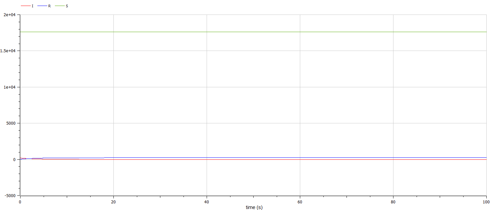

---
## Front matter
lang: ru-RU
title: Лабораторная работа номер 6
author: Malkov Roman Sergeevich
date: 01.03.2024

## Formatting
toc: false
slide_level: 2
theme: metropolis
header-includes: 
 - \metroset{progressbar=frametitle,sectionpage=progressbar,numbering=fraction}
 - '\makeatletter'
 - '\beamer@ignorenonframefalse'
 - '\makeatother'
aspectratio: 43
section-titles: true
---

# Цель работы

Изучить и построить модель эпидемии.

# Теоретическое введение. Построение математической модели.

Рассмотрим простейшую модель эпидемии. Предположим, что некая популяция, состоящая из $N$ особей, (считаем, что популяция изолирована) подразделяется на три группы. Первая группа - это восприимчивые к болезни, но пока здоровые особи, обозначим их через $S(t)$. Вторая группа – это число инфицированных особей, которые также при этом являются распространителями инфекции, обозначим их $I(t)$. А третья группа, обозначающаяся через $R(t)$ – это здоровые особи с иммунитетом к болезни. 
До того, как число заболевших не превышает критического значения $I^*$, считаем, что все больные изолированы и не заражают здоровых. Когда $I(t)> I^*$, тогда инфицирование способны заражать восприимчивых к болезни особей. 

# Теоретическое введение. Построение математической модели.

Таким образом, скорость изменения числа $S(t)$ меняется по следующему закону:

$$
\frac{dS}{dt}=
 \begin{cases}
	-\alpha S &\text{,если $I(t) > I^*$}
	\\   
	0 &\text{,если $I(t) \leq I^*$}
 \end{cases}
$$

# Теоретическое введение. Построение математической модели.

Поскольку каждая восприимчивая к болезни особь, которая, в конце концов, заболевает, сама становится инфекционной, то скорость изменения числа инфекционных особей представляет разность за единицу времени между заразившимися и теми, кто уже болеет и лечится, то есть:

$$
\frac{dI}{dt}=
 \begin{cases}
	\alpha S -\beta I &\text{, если $I(t) > I^*$}
	\\   
	-\beta I &\text{, если $I(t) \leq I^*$}
 \end{cases}
$$

# Теоретическое введение. Построение математической модели.

А скорость изменения выздоравливающих особей (при этом приобретающие иммунитет к болезни):

$$\frac{dR}{dt} = \beta I$$

Постоянные пропорциональности $\alpha, \beta$ - это коэффициенты заболеваемости и выздоровления соответственно. Для того, чтобы решения соответствующих уравнений определялось однозначно, необходимо задать начальные условия. Считаем, что на начало эпидемии в момент времени $t=0$ нет особей с иммунитетом к болезни $R(0)=0$, а число инфицированных и восприимчивых к болезни особей $I(0)$ и $S(0)$ соответственно. Для анализа картины протекания эпидемии необходимо рассмотреть два случая:  $I(0) \leq I^*$ и  $I(0)>I^*$

# Задание

**Вариант 59**

На одном острове вспыхнула эпидемия. Известно, что из всех проживающих
на острове (N=17 854) в момент начала эпидемии (t=0) число заболевших людей
(являющихся распространителями инфекции) I(0)=199, А число здоровых людей с
иммунитетом к болезни R(0)=35. Таким образом, число людей восприимчивых к
болезни, но пока здоровых, в начальный момент времени S(0)=N-I(0)- R(0).
Постройте графики изменения числа особей в каждой из трех групп.
Рассмотрите, как будет протекать эпидемия в случае: 

1.	$I(0)\leq I^*$

2.	$I(0)>I^*$

# Выполнение лабораторной работы

Код программы для случая $I(0) \leq I^*$:

{ #fig:001 width=70% height=70% }

# Выполнение лабораторной работы

Код программы для случая $I(0)>I^*$:

{ #fig:002 width=70% height=70% }

# Выполнение лабораторной работы

{ #fig:003 width=70% height=70% }

# Выполнение лабораторной работы

{ #fig:004 width=70% height=70% }

# Выполнение лабораторной работы

Код программы для случая $I(0) \leq I^*$:

{ #fig:005 width=70% height=70% }

# Выполнение лабораторной работы

Код программы для случая $I(0)>I^*$:

{ #fig:006 width=70% height=70% }

# Выполнение лабораторной работы

{ #fig:007 width=70% height=70% }

# Выполнение лабораторной работы

{ #fig:008 width=70% height=70% }

# Анализ полученных результатов. Сравнение языков.

В итоге проделанной работы мы построили графики зависимости численности особей трех групп S, I, R для случаев, когда больные изолированы и когда они могут заражать особей группы S. 

Построение модели эпидемии на языке OpenModelica занимает значительно меньше строк, чем аналогичное построение на Julia. Кроме того, построения на языке OpenModelica проводятся относительно значения времени t по умолчанию, что упрощает нашу работу.

# Вывод

В ходе выполнения лабораторной работы была изучена модель эпидемии и построена модель на языках Julia и Open Modelica.

# Список литературы. Библиография.

[1] Документация по Julia: https://docs.julialang.org/en/v1/

[2] Документация по OpenModelica: https://openmodelica.org/

[3] Решение дифференциальных уравнений: https://www.wolframalpha.com/

[4] Конструирование эпидемиологических моделей: https://habr.com/ru/post/551682/